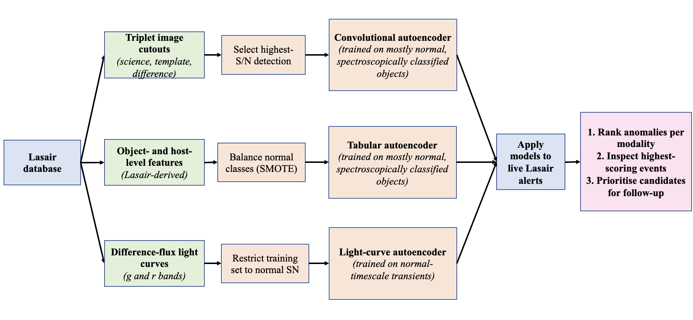

# AHA: Anomaly Hunter for Alerts

**AHA (Anomaly Hunter for Alerts)** is an unsupervised anomaly-detection pipeline designed for large-scale astronomical alert streams, developed and tested using the Zwicky Transient Facility (ZTF) alerts accessed via the **Lasair broker**.

The core goal of this project is to identify *unusual, rare, or poorly characterized transients* in real time, without relying on labeled training data, by treating different alert-stream data products **independently** rather than forcing them into a single combined model.

This repository contains the **analysis notebooks** used in the accompanying paper, and is intended as a transparent, readable reference for how the pipeline works end-to-end.

**Paper:**  
*Anomaly Hunter for Alerts (AHA): Unsupervised Anomaly Detection in the ZTF Transient Alert Stream*  
Leyla Iskandarli, Chris J. Lintott, Steve Croft (draft) 

---

## Overview of the Pipeline

ZTF alert packets contain multiple data modalities, each encoding different information about a transient.  
Rather than combining them into a single model, **AHA trains one autoencoder per modality**:

- **Object-level features** 
- **Triplet image cutouts** 
- **Light curves**

Each autoencoder produces its own anomaly score. This design:
- maximizes alert coverage when data are missing in one modality,
- highlights *different kinds* of anomalies,
- and avoids bias toward any single representation.

The final output is a ranked list of anomalous objects suitable for inspection and follow-up.

---

## Pipeline Flowchart

The figure below summarises the full AHA workflow, from data ingestion through anomaly ranking and follow-up prioritisation.

---

## Repository Structure & Notebooks

The notebooks are ordered to reflect the logical flow of the analysis.  
They are **not packaged as a production pipeline**, but rather as a transparent, step-by-step research workflow.

### 01. `Create_Training_Data.ipynb`
Constructs the labeled training, validation, and test datasets from the Lasair databank.

### 02. `Gather_Triplet_Cutout_Images.ipynb`
Retrieves and processes ZTF alert **triplet image cutouts** (science, template, difference).

### 03. `Applying_SMOTE_oversampling.ipynb`
Addresses class imbalance in the training data.

### 04. `ObjectFeature_Autoencoder.ipynb`
Trains and evaluates an autoencoder on **Lasair object-level features**. This includes statistical features of the light curve, brightness measurements and host galaxy information.

### 05. `TripletImage_Autoencoder.ipynb`
Trains a convolutional autoencoder on **alert image cutouts**.

### 06. `LightCurve_Autoencoder.ipynb`
Trains an autoencoder on **g and r-band light curves**.

## What This Repository Is (and Is Not)

**This repository is:**
- a research reference implementation
- designed for clarity and reproducibility
- closely tied to the accompanying paper

**This repository is not:**
- a single unified end-to-end executable
- optimized for deployment at scale

**please feel free to open an issue or reach out.**  
Questions are very welcome!

---

## Citation

If you use or adapt this work, please cite the accompanying paper (details to be updated upon submission).

---

*Developed by Leyla Iskandarli (Oxford / Breakthrough Listen).*
